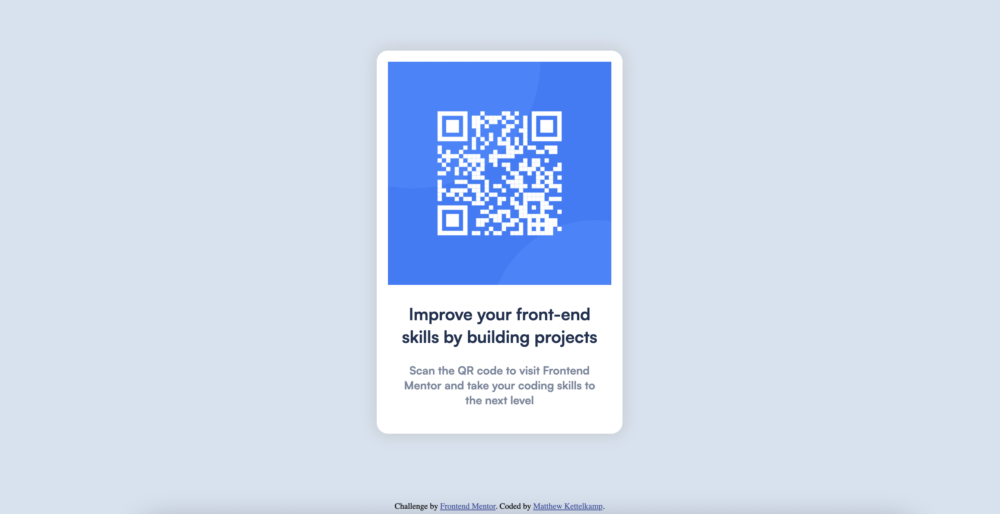

# Frontend Mentor - QR code component solution

This is a solution to the [QR code component challenge on Frontend Mentor](https://www.frontendmentor.io/challenges/qr-code-component-iux_sIO_H). Frontend Mentor challenges help you improve your coding skills by building realistic projects.

## Table of contents

- [Overview](#overview)
  - [Screenshot](#screenshot)
- [My process](#my-process)
  - [Built with](#built-with)
  - [What I learned](#what-i-learned)
  - [Continued development](#continued-development)
- [Author](#author)

**Note: Delete this note and update the table of contents based on what sections you keep.**

## Overview

### Screenshot

## My process

I started with the html structuring and then after getting a nice little card in the middle i began to design from the outside in. Start with centering the image and text. I changed the background colors and added some border radius to the card. Continued down this path. Nothing too crazy to note for this process.

### Built with

- Semantic HTML5 markup
- SCSS custom properties / live precompiler with VS Code extension
- Flexbox
- Mobile-first workflow

### What I learned

Making a small card element is great practice on how to make something responsive
and learn how to imagin the html in your head as you are building. It is a great
little first project and I am excited to challenge myself more now.

### Continued development

I am pumped to continue to get better at making better resusable elements and start doing more JS as well.

## Author

- Website - [Matthew Kettelkamp](https://www.matthewkettelkamp.com)
- Frontend Mentor - [@yourusername](https://www.frontendmentor.io/profile/mkettel)
